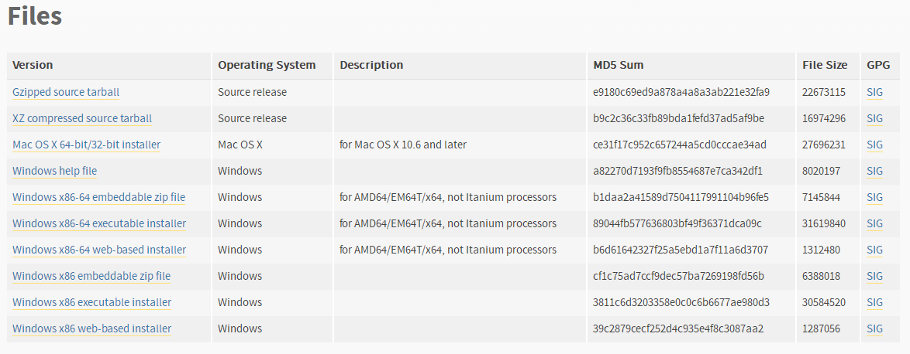
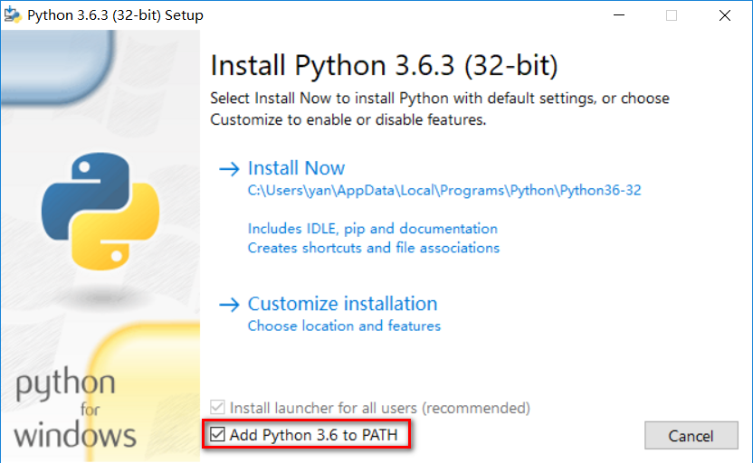
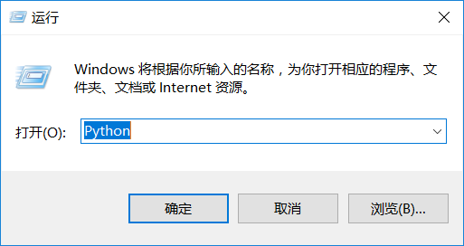
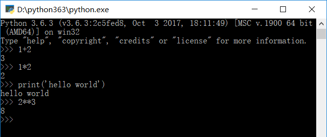
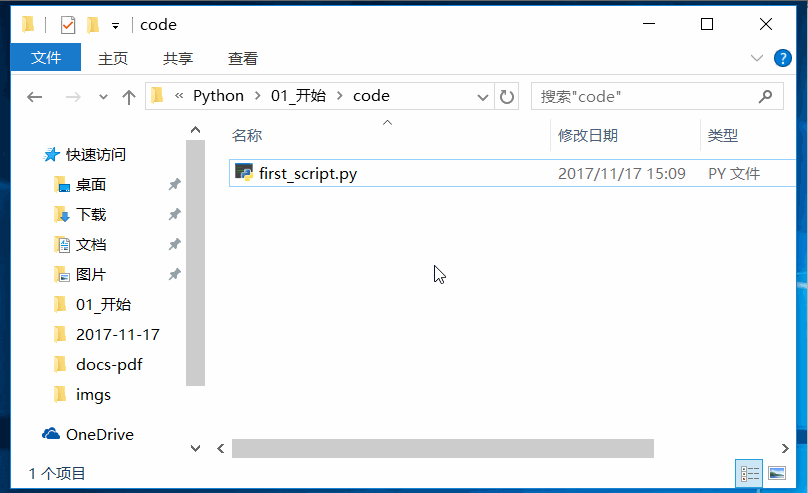
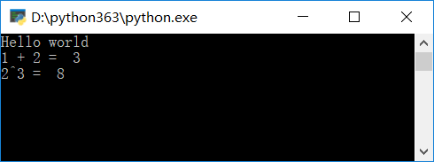
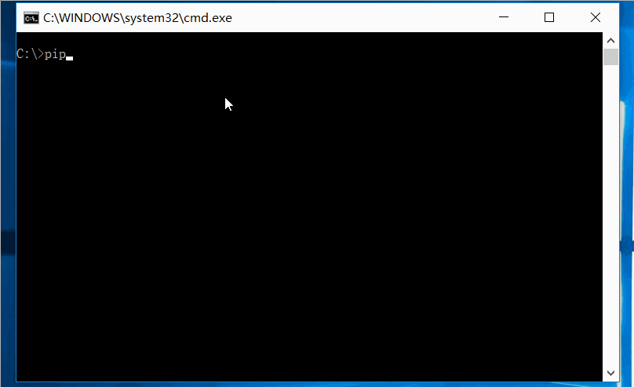
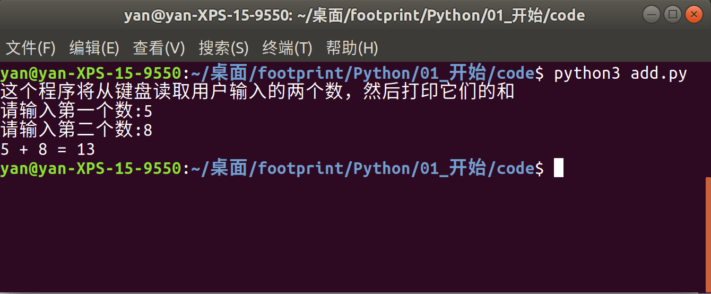

# Python 的简单介绍、安装及使用

这个部分简单介绍了 Python，Python 的安装，Python 的简单使用，Python 第三方模块的安装以及简单的输入输出。

## Python 简介

Python 是一门易学、强大的编程语言。它有高效的高级数据结构和简单高效的面向对象编程方法。Python 优雅的语法、动态类型以及其解释执行特性使得 Python 在很多领域都是理想的脚本语言和快速应用程序开发工具。

Python 解释器和大量的标准库可以从官网免费获取。Python 能够运行在大多数主流平台上，包括 Windows、Linux 和 macOS。

## Python 的安装

### Python 下载

[Python 下载](https://www.python.org/downloads/release/python-363/)



根据自己的系统，下载相应的文件：

- 对于 Windows 系统，如果是 32 位的，一般下载 Windows x86 executable installer. 如果是 64 位的，一般下载 Windows x86-64 executable installer.

### Python 安装

在安装 Python 的时候，如下图所示，推荐勾选 Add Python 3.6 to PATH，这样的话，我们就可以在命令行中输入 **python** 启动 Python 交互式解释器和运行 Python 安装目录下 Scripts 目录中的一些命令而不用切换到相应的目录下。

其他选项保持默认，然后一步一步按照指示进行安装就可以了。



## Python 的简单使用

我们可以进入 Python 的交互式运行环境，然后通过一条一条输入命令让 Python 执行并得出结果；也可以将 Python 命令写在一个文件中，然后运行。

### 交互式运行 Python 命令

按 Windows 键加 R 键可以打开运行对话框，我们可以在对话框中输入 Python 来打开 Python 交互运行环境并在里面输入 Python 命令来让 Python 运行并给我们结果。



进入 Python 交互运行环境后，我们可以输入 Python 命令（函数、表达式）然后回车，Python 会立即运行并把结果打印出来：



其中：

- `>>>` , 这个符号是 Python 的提示符
- `1+2`, 这是一个 Python 表达式。当我们回车后，这个表达式的结果 3 就被打印出来了。同理 `1*2` 也是一样的
- `print('hello world')`,  这是一个 Python 内置函数，功能是将括号中的字符串打印出来。
- `2**3`, 是一个表达式, 表示的是 2 的 3 次方，结果是 8


要退出交互式运行环境，输入命令 `exit()` 并回车。或者按 Ctrl + Z, 然后回车（这是 Windows 上的快捷键）。

### 运行 Python 脚本

交互环境中只能一条一条地输入 Python 命令，然后一条一条地执行。而且一旦退出，所写的所有命令都随之消失。如果想把命令保存在文件中以便将来能够重复执行的话，就需要将 Python 命令（程序、源代码、模块、脚本）保存在一个以 .py 结尾的文件中. 以.py 结尾的文件可以叫做 Python 程序, 也可以叫 Python 脚本, Python 源代码, Python 模块等.

*first_script.py*

```python
print('Hello world')
print('1 + 2 = ', 1 + 2)
print('2^3 = ', 2**3)
```

我们将上述的 Python 代码保存在 first_script.py 文件中. 然后可以打开 cmd 窗口输入 **python first_script.py** 来执行.



在 Windows 下, 我们也可以通过双击来执行(如果 .py 后缀关联了 python.exe 程序的话). 当我们双击执行的时候, 会有一个一闪而过的黑窗口. 这是因为程序执行完以后就退出了, 如果想要看到程序执行的结果, 我们可以在代码最后一行添加一句等待用户输入的命令:

```python
input()
```



上图是我们双击运行的效果. 程序打印出结果后, 等待我们输入, 我们随便点击键盘上的任意一个键, 程序就会退出.

## Python 安装第三方模块

Python 自带有一个包管理工具 pip , 通过它我们可以安装我们需要的第三方模块, 例如 ipython, xlwings , openpyxl, PyQt5 等.

使用 pip 安装 Python 第三方模块包的方法很简单, 只需要打开 cmd 窗口, 输入`pip install packagename` 即可. 其中 packagename 是我们要安装的第三方模块的名称.

pip 默认从 Python 官方源获取第三方模块包, 这样的话下载速度会比较慢. 我们可以改变其源来加快其下载速度. 具体的操作方法参考: [更改 pip 源加快下载速度](https://mirrors.tuna.tsinghua.edu.cn/help/pypi/)



## Python 输入输出简单介绍

编写程序的目的在于解决实际中的问题，例如把一个文件夹下的所有文件的文件名都加一个前缀；把一个文件夹下的所有照片都改为另外一个尺寸...。不管对于什么问题，我们都可以将其抽象为**获取数据**、**保存数据**、**处理数据**、**保存数据**、**输出结果**。

以将一个文件夹下的所有文件的文件名加一个前缀来说。首先我们需要获取该文件夹下的所有文件，然后将它们保存在某处。这一步对应于获取数据、保存数据；然后我们为每一个文件添加一个前缀，这一步对应于处理数据；然后我们将重命名了的文件保存，然后程序退出，这一步对应于保存数据和输出结果（没有输出结果也是一种输出结果）。

现在就来举一个简单的例子来印证我所说的处理问题的 5 个步骤。我们将写一个小程序来计算用户输入的两个数的和。

```python
print('这个程序将从键盘读取用户输入的两个数，然后打印它们的和')

a = input('请输入第一个数:')
b = input('请输入第二个数:')
a = int(a)
b = int(b)
print(a, '+', b, '=', a+b)
```



`print('这个程序将从键盘读取用户输入的两个数，然后打印它们的和')` 这句代码的作用是将引号中的内容打印出来，给用户一个提示。

`a = input('请输入第一个数:')` 这句代码会把引号里面的内容打印出来，然后程序暂停等待用户输入数据，我们输入 5 回车后，a 中就保存了我们输入的字符 5 ，注意不是数字 5。同理 `b = input('请输入第二个数:')` 的作用是类似的。

```python
a = int(a)
```

这句代码的意思是将 a 中保存的字符 5 转换为整数，然后再保存在 a 中。最后一句代码就是打印 a 里面的值，加号，b 里面的值，等号和 a + b 的值。

在这个小例子中，我们获取数据，然后保存数据，处理数据，输出结果。由于我们没有永久地将输入的数据保存起来，因此当程序退出的时候，我们的数据就没有了。在这个例子中，我们是让用户输入数据来获取数据的，但我们还可以直接在代码中写我们需要的数据、从文件中读取数据、从数据库中读入数据、从网络上下载数据等等。总之，我们获取数据的方式是多样的。

在这个例子中，我们将获取的数据保存在 a，b 中，a 和 b 叫做变量，是一块内存。我们将数据保存在内存中，a 和 b 是我们保存数据的内存的名字，通过 a ，b 这两个名字，我们可以获得它们指示的内存中的值，这可以从我们例子中的最后一句代码看出来。

我们说我们通过 `input()` 获取的是字符，然后我们又说通过 `int(a)` 把 a 中保存的字符转换为整数。这里说的字符（在 python 中，字符和字符串是一样的，字符就是只有一个元素的字符串）、整数叫做**数据类型**。数据类型在任何编程语言中都是核心，因为数据类的类型决定着数据可以进行的操作，整数可以进行加减乘除，但是字符不可以，这就是我们为什么要将字符转化为整数的原因。

