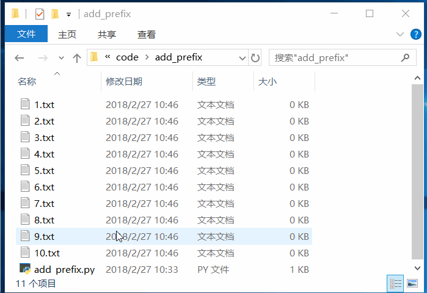

# 数据的获取、存储以及操作

程序的目的是解决实际生活中的问题，而不论是什么样的问题，我们都可以将其解决过程抽象为**数据的获取**、**存储**以及**操作**。例如，我要将一个文件夹下面的所有`.txt` 文件的名称前面加一个前缀`[www.baidu.com]`，对于这个问题来说，首先：

1. 获取数据：获取这个文件夹下面的所有 `.txt` 文件的列表
2. 存储数据：存储获取的文件名称列表
3. 操作数据：将文件名添加前缀



*add_prefix.py*

```python
import os
import shutil

for f in os.listdir():
    if f.endswith('.txt'):
        shutil.move(f, '[www.baidu.com]' + f)

```


