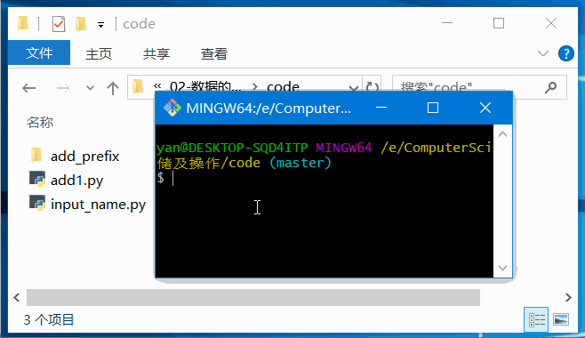

# 概览

[TOC]

## 几个例子

### 例子1：求两个数的和

让我们先来看这个简单的代码：

*add1.py*

```python
number1 = 5
number2 = 10
number3 = number1 + number2
print(number1, "+", number2, "=", number3)

```

运行上面的代码，得到的结果如下：


第1句代码 `number1 = 5` 我们得到了一个整数 5，并且将它保存到了计算机内存中的某处，然后给它起了一个名字叫 number1。从此以后 number1 就代表了我们得到的整数（除非我们给另外一个数据也起名叫 number1，这时候 number1 就代表了新的数据），以后我们需要访问它或者修改它的时候，只需要写 number1 即可。 

因此，通俗地说，通过形如 `名字 = 数据` 的方式，我们得到了一个数据，并将其保存到了计算机内存的某处，还给其起了一个名字。更专业地，上述过程我们做了如下三件事：

1. 创建了一个变量，即我们在计算机内存中得到了一个空间（**变量**就是内存中的空间）。
2. 给这个变量赋了一个值，即我们把一个值保存到了这个空间中（这个过程就叫做**赋值**）。
3. 给这个变量起了一个名字，即让这个变量的名字代表了这个变量（**变量名**就是变量的名字）。

第3句代码 `number3 = number1 + number2`表示我们将 number1 代表的数加上 number2 代表的数保存在内存中的某处，然后给它起一个名字叫 number3。 简化地说则是，我们将 number1 加上 number2 的和保存在变量 number3 中。

第4句代码`print(number1, "+", number2, "=", number3)` 则是在操作数据。print() 是一个函数，它可以将写在括号里面的东西打印出来，如果给的是变量，则打印变量的值；如果给的是字符串，则原样打印；如果需要打印多个东西，则每一个之间使用逗号隔开；默认情况下，每个打印出来的东西之间会用空格隔开（我们可以改变这个默认设置，这个以后再说）。

> **函数**：函数就是别人已经写好的、我们可以直接使用的、能完成某个特定功能的代码。当我们使用别人的函数完成某件事情时，我们称我们**调用**了某个函数，我们就是函数的调用者；如果函数运行完成后有值返回给调用者，则称这个值为**返回值**。我们调用某个函数时，需要写函数的名字——函数名，然后后面跟上一个括号，括号里面的东西叫调用函数的**实际参数**，简称**实参**。如果调用一个函数需要多个实参，那么每一个实参使用逗号分隔。例如函数调用 `print(number1, "+", number2, "=", number3)`，print 是函数名，括号里面使用逗号分隔的每一个变量或者字符串都是函数的实参，print 函数的作用就是将这些实参。
>
> **字符串**：字符串就是使用引号（在Python中可以是单引号、双引号或者三引号）引起来的任何东西，例如"hello world"、'''hello world'''、"""hello world""".

上面这个例子将数据的获取、存储以及操作都做了简单的说明。我们通过形如 `名字 = 数据` 的方式获得了一个数据，这里的数据是我们自己写在代码里面的。这是最简单的获取数据的方式。但是在现实问题中，一般我们都是从用户输入、网络、数据库、文件等地方获取数据。

还有，上面这个例子，我们将一个整数 5 保存在变量 number1 中，将整数 10 保存在变量 number2 中。这里的 5、10 是整数，它们遵循数学运算，我们将它们的和保存在变量 number3 中。这里的整数是现实生活中的一种**数据类型**，这种数据类型可以进行数学运算操作。

> 数据类型：数据类型其实就是给数据做的分类。计算机学科里面的数据类型的含义包含数据的取值范围以及可以进行的操作。例如整数是一种数据类型，我们假设叫它整数类型，那么它的取值范围则是 min~max，min是计算机可以保存的最小整数，max 是计算机能够保存的最大整数。整数可以进行的操作有加减乘除四则运算等。数据类型是如此重要以致于怎么强调都不为过，因为编程基本上就是在和各种各样的数据类型打交道，我们或亲自创建某种数据类型，或创建、获取某种数据类型的数据，或将其他类型的数据转为为我们需要的数据类型，然后对这些数据进行各种运算，最后得出结果。

在 Python 中，我们要学到很多数据类型：

1. 数字类型：包括整数、小数、复数等
2. 序列类型：列表、元祖、字符串
3. 映射类型：字典
4. 集合类型

我们主要通过以下的两条线索来学习这些数据类型：

1. 学习这种数据类型的特点，知道这种数据类型的数据范围；判断一个数据是否是该种数据类型的数据；如何创建（获取）这种数据类型的数据；
2. 这种数据类型的数据可以进行哪些操作。

### 例子2：让用户输入自己的名字

*input_name.py*

```python
user_name = input('Your name? ')
print('Hello,', user_name)

```



上面这个例子中，我们使用了 `input(提示用户的字符串)` 函数来让用户输入数据，然后保存在 `user_name` 变量中。通过 `input` 函数，我们得到了一个字符串类型的数据。然后我们使用 `print` 函数打印出了 'hello,' 以及用户输入的名字。

以上就是获取数据的第二种方法——使用 `input` 函数让用户输入数据。

### 例子3：求用户输入的两个整数的和

*sum.py*

```python
# 以井号开头的是注释，程序在运行的时候会忽略注释
number1 = input('Enter the first number: ')  # 获得用户输入的字符串
number2 = input('Enter the second number:')  # 获取用户输入的字符串

number1 = int(number1)  # 使用 int 函数将用户输入的字符串数据转换为整数数据
number2 = int(number2)  # 使用 int 函数将用户输入的字符串数据转换为整数数据

number3 = number1 + number2

print(number1, '+', number2, '=', number3)

```


> 注释：在 Python 中，以#开头的是注释。注释是写给人看的，用来提醒编程人员某句代码的含义或者做一些版权的声明等。程序在执行的时候会忽略注释。

正如例子 2 中所做的说明，调用 `input` 函数得到的是用户输入的字符串数据，如果我们不作任何的转换，那么两个字符串数据相加的结果肯定不会是我们要的结果（实际上，两个字符串相加就是将两个字符串连在一起，例如“12” + “10” 的结果是“1210”），因此，我们调用 `int` 函数来把字符串数据转换为整数类型的数据。

> 类型转换：将某个T1类型的数据转换为T2类型。

### 总结

这个部分讲解了获取数据的两种方法：

1. 直接在代码里面写出我们想要的数据然后保存在变量里面；
2. 让用户输入数据，然后或直接使用，或转换为我们想要的类型。

在这个过程中，我们还涉及到了一些基本的概念，例如变量、赋值、变量名、函数（以及与函数有关的概念）、字符串、类型转换等；我们还涉及了一些简单的操作数据的方法，例如把两个整数相加，使用 `print` 函数把数据打印出来，将字符串数据转换为整数等。

接下来，我们将学习 Python 内置的数据类型，我们如何创建、获取这些类型的数据；这些类型的数据可以进行什么样的操作。

## Python  常用的内置类型

Python 中的常用内置类型如下：

1. 数字类型：int、float、complex
2. 序列类型：list、tuple、range
3. 字符串类型：str
4. 集合类型：set、frozenset
5. 映射类型：dict
6. 二进制序列类型：bytes、bytearray、memoryview


